# pfSense Firewall Home Lab — Segmentation, Traffic Analysis, and DoS Mitigation

> A hands-on VirtualBox lab that places a Kali Linux attacker on the WAN side of a pfSense firewall and an Ubuntu victim on an isolated LAN. The project demonstrates routing, DHCP/DNS, packet analysis with Wireshark, controlled TCP SYN traffic, and firewall-based mitigation.

## Project Overview

I built this lab to practice network segmentation and firewall administration in an environment where I could generate and inspect traffic safely. Rather than placing every VM on the same virtual network, I used pfSense as the routing and policy boundary between a WAN-side Kali VM and a protected Ubuntu LAN.

The lab was based on Royden Rebello's pfSense/Kali/Ubuntu walkthrough, but I adapted the addressing to my own home network and documented the troubleshooting I encountered instead of copying the example IP addresses directly.

## Skills Demonstrated

- pfSense installation and interface assignment
- VirtualBox bridged and internal networking
- WAN/LAN network segmentation
- IPv4 subnetting and routing
- DHCP configuration
- DNS troubleshooting with Unbound
- Static route configuration on Linux
- Stateful firewall rule creation and ordering
- Wireshark packet filtering and validation
- Controlled TCP SYN traffic generation with `hping3`
- Before/after validation of firewall mitigation
- Log-driven troubleshooting

## Lab Architecture

```text
                         Internet
                            |
                      Home Router
                     192.168.4.1
                            |
              Home/WAN Network 192.168.4.0/22
                   /                    \
                  /                      \
        Kali Linux                     pfSense WAN
        192.168.4.103                  192.168.4.104
        (Attacker)                          |
                                            | Firewall / Routing
                                            |
                                      pfSense LAN
                                      192.168.1.1/24
                                            |
                                      VirtualBox LabNet
                                      192.168.1.0/24
                                            |
                                      Ubuntu Desktop
                                      192.168.1.100
                                      (Victim)
```

| System | VirtualBox Network | IP Address | Role |
|---|---|---|---|
| Kali Linux | Bridged Adapter | `192.168.4.103/22` | WAN-side test/attacker host |
| pfSense WAN (`em0`) | Bridged Adapter | `192.168.4.104/22` | Firewall WAN interface |
| pfSense LAN (`em1`) | Internal Network `LabNet` | `192.168.1.1/24` | Gateway, DHCP, and DNS for lab LAN |
| Ubuntu | Internal Network `LabNet` | `192.168.1.100/24` | Protected victim/workload |

## 1. pfSense and VirtualBox Configuration

The pfSense VM uses two virtual NICs:

- **Adapter 1 — Bridged:** connects pfSense WAN to the physical/home network.
- **Adapter 2 — Internal Network (`LabNet`):** creates an isolated network for protected lab machines.

Ubuntu is attached only to `LabNet`. Kali remains bridged so it represents a system outside the protected LAN.

The pfSense LAN interface was configured as:

```text
LAN:        192.168.1.1/24
DHCP pool:  192.168.1.100 - 192.168.1.199
```

Ubuntu successfully obtained `192.168.1.100/24` from pfSense DHCP, confirming that the internal VirtualBox network and DHCP service were functioning.

## 2. Connectivity Validation

I tested the network in layers rather than assuming that Internet access meant every service was working.

From Ubuntu:

```bash
ping -c 4 192.168.1.1
ping -c 4 8.8.8.8
ping -c 4 google.com
```

The first two tests succeeded. This proved:

```text
Ubuntu -> pfSense LAN       PASS
Ubuntu -> Internet by IP    PASS
Ubuntu -> DNS name lookup   FAIL (initially)
```

That distinction became important during troubleshooting.

## 3. DNS Resolver Troubleshooting

### Symptom

Ubuntu had a valid DHCP address and could reach the Internet by IP, but DNS failed:

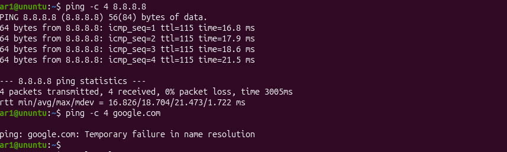

Ubuntu had correctly received pfSense as its DNS server:

```text
Current DNS Server: 192.168.1.1
DNS Servers:        192.168.1.1
```

A direct lookup against pfSense timed out:

```bash
nslookup google.com 192.168.1.1
```

This narrowed the problem to DNS service on pfSense rather than routing or DHCP.

### Finding the Failure

Under **Status > Services**, the pfSense `unbound` DNS Resolver service was stopped:

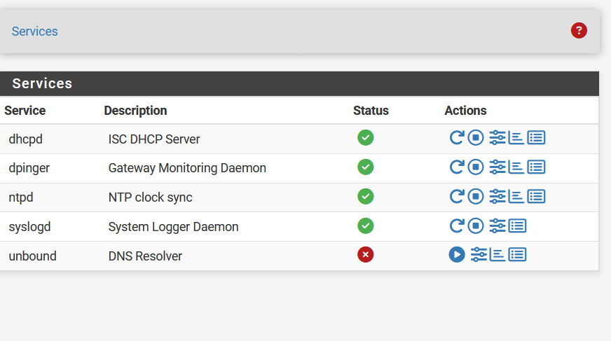

The resolver configuration itself was enabled and listening on port 53:

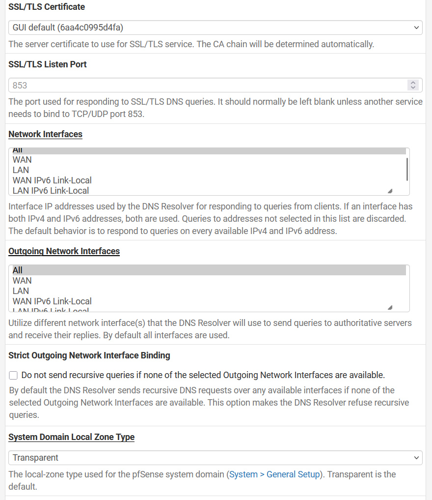

The Unbound logs revealed the useful error:

```text
error parsing local-data at 2 '.. A 192.168.1.1': Empty label
error: Bad local-data RR .. A 192.168.1.1
fatal error: Could not set up local zones
```

### Root Cause and Fix

Under **System > General Setup**, the pfSense hostname existed but the **Domain** field was empty:

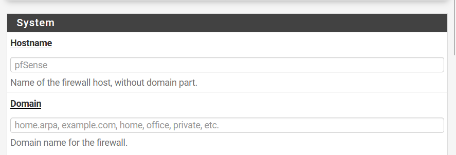

I set the domain to:

```text
home.arpa
```

After saving the configuration, Unbound started successfully and Ubuntu could resolve Internet hostnames:

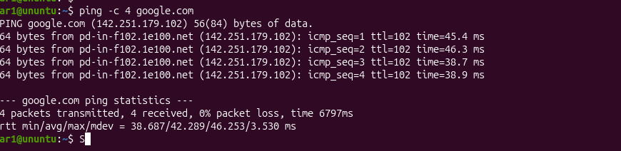

### Troubleshooting Lesson

The key was separating **IP connectivity** from **name resolution**. Because `8.8.8.8` was reachable while `google.com` was not, changing VirtualBox adapters, routes, or DHCP addressing would have been unnecessary. Checking the configured DNS server and then the DNS service/logs led directly to the root cause.

## 4. Routing Kali to the Protected LAN

Kali is on `192.168.4.0/22`, while Ubuntu is behind pfSense on `192.168.1.0/24`. Kali therefore needed an explicit route telling it to use the pfSense WAN interface to reach the internal subnet.

```bash
sudo ip route add 192.168.1.0/24 via 192.168.4.104
```

Verification:

```bash
ip route
ping -c 4 192.168.1.100
```

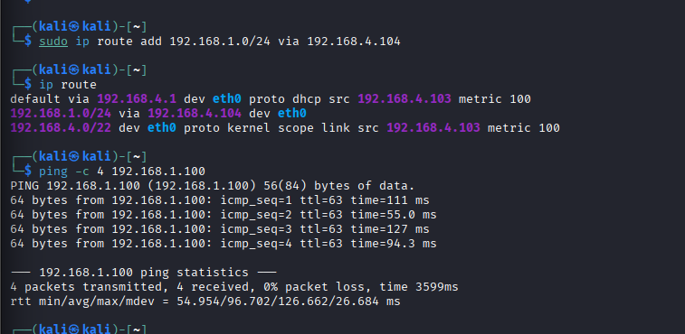

The successful ping confirmed the path:

```text
Kali 192.168.4.103
        |
        v
pfSense WAN 192.168.4.104
        |
   firewall/routing
        |
        v
pfSense LAN 192.168.1.1
        |
        v
Ubuntu 192.168.1.100
```

A temporary WAN pass rule allowed Kali to reach Ubuntu so the traffic could be observed before mitigation.

## 5. Controlled TCP SYN Test — Before Blocking

> **Lab safety:** All traffic in this project was generated against systems in my own isolated/authorized home-lab environment. For portfolio evidence I used a small, controlled packet count instead of an unrestricted flood.

Wireshark was started on Ubuntu's `enp0s3` interface. I used this display filter to isolate only the traffic of interest:

```text
ip.src == 192.168.4.103 && ip.dst == 192.168.1.100 && tcp.dstport == 80
```

From Kali, I generated 20 TCP SYN packets to Ubuntu port 80:

```bash
sudo hping3 -S -p 80 -c 20 192.168.1.100
```

### Before Mitigation

Wireshark clearly captured SYN packets from Kali reaching Ubuntu:

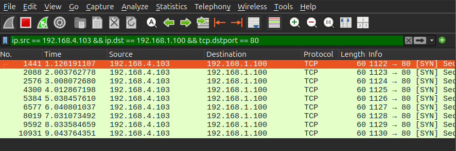

The packet flow was therefore:

```text
Kali                     pfSense                     Ubuntu
192.168.4.103 -- SYN -->  ALLOW  -- SYN ----------> 192.168.1.100:80
                                                     Wireshark: VISIBLE
```

## 6. pfSense Mitigation

I added a WAN block rule above the broader allow rules:

```text
Action:       Block
Protocol:     IPv4 (all)
Source:       192.168.4.103
Destination:  192.168.1.100
```

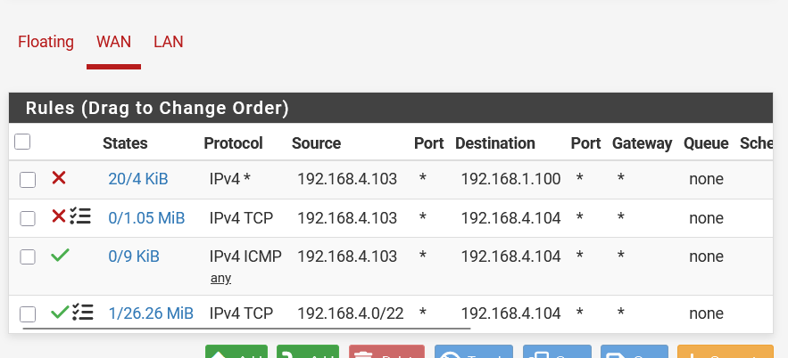

The rule was deliberately placed at the top because pfSense interface rules are evaluated in order. A specific block must be encountered before a broader matching pass rule.

## 7. Verification — After Blocking

I repeated the same controlled test from Kali:

```bash
sudo hping3 -S -p 80 -c 20 192.168.1.100
```

Kali reported no replies:

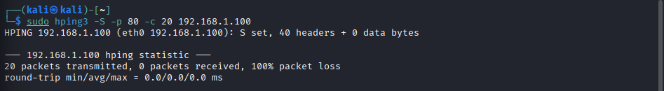

At the same time, the pfSense block rule showed matching traffic in its counter:

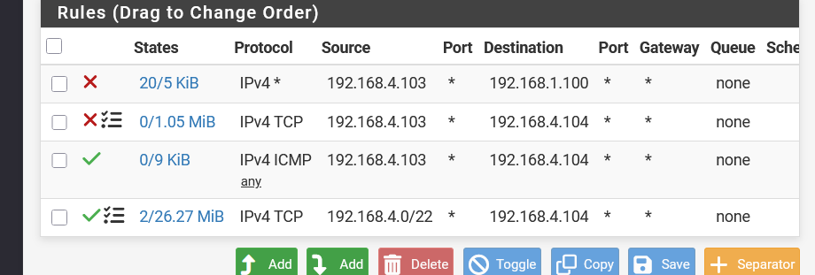

Most importantly, Ubuntu's Wireshark capture using the exact same filter was empty:

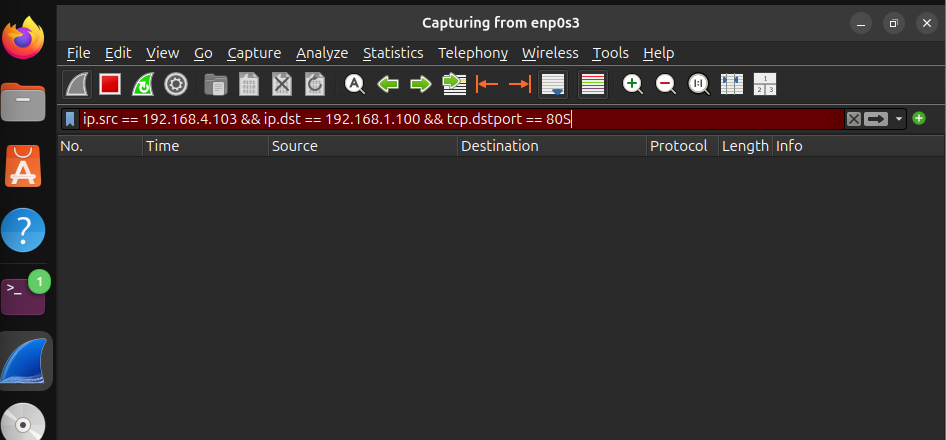

### Before vs. After

```text
BEFORE
Kali -- SYN --> pfSense -- SYN --> Ubuntu
                                Wireshark sees packets

AFTER
Kali -- SYN --> pfSense --X       Ubuntu
                  BLOCK           Wireshark sees nothing
```

This provides three independent validation points:

1. Kali generated the test traffic.
2. pfSense matched it against the block rule.
3. Ubuntu no longer observed the packets.

## 8. Firewall Rule Troubleshooting

During testing, I initially created a block rule with the wrong destination. The test command was targeting pfSense WAN (`192.168.4.104`), while the rule was intended for Ubuntu (`192.168.1.100`). The rule counter remained at zero because the traffic did not match the rule.

This reinforced a simple but important firewall troubleshooting process:

```text
Check source IP
      +
Check destination IP
      +
Check protocol/port
      +
Check interface
      +
Check rule order
      +
Check counters/logs
```

Once the destination matched the actual test flow, the rule counter increased and the expected policy took effect.

## 9. What I Learned

This project went beyond installing a firewall. The most valuable part was troubleshooting the traffic path layer by layer.

I practiced identifying which network a host belongs to from its address and mask, distinguishing pfSense WAN and LAN roles, understanding why Kali needed a static route to the internal subnet, using rule counters as evidence of policy matches, and using packet captures to verify whether traffic actually reached the protected endpoint.

The DNS issue was particularly useful because routing was fully functional while name resolution was broken. Instead of treating “no Internet” as one problem, I isolated DHCP, gateway connectivity, Internet routing, DNS client configuration, the Unbound service, and finally its logs.

## 10. Future Improvements

Potential extensions for this lab include:

- Restricting management access to HTTPS/443 from a specific trusted management host instead of broad WAN access.
- Creating separate VLANs for servers, clients, and security tooling.
- Forwarding pfSense logs to a SIEM such as Wazuh.
- Building alerting around repeated firewall blocks or abnormal connection rates.
- Adding IDS/IPS monitoring with Suricata or Snort.
- Testing additional firewall policies with controlled, rate-limited traffic.
- Persisting the Kali static route through its network configuration rather than adding it manually after reboot.

## Tools Used

- pfSense CE 2.9.0
- Oracle VirtualBox
- Kali Linux
- Ubuntu Linux
- Wireshark
- `hping3`
- Linux networking utilities: `ip`, `ifconfig`, `ping`, `nslookup`, `resolvectl`

## Reference

This project was adapted from the **Home-Lab Walk-Through: pfSense ↔ Kali ↔ Ubuntu (DoS Defense Demo)** by Royden Rebello (TheSocial Dork). I used my own addressing, configuration, troubleshooting evidence, and controlled validation steps while following the lab's attacker/firewall/victim architecture.

---

**Outcome:** Built a functioning two-zone firewall lab, configured routing/DHCP/DNS, diagnosed an Unbound DNS failure from logs, observed controlled TCP SYN traffic in Wireshark, blocked the source with pfSense, and verified that the traffic no longer reached the protected Ubuntu host.
